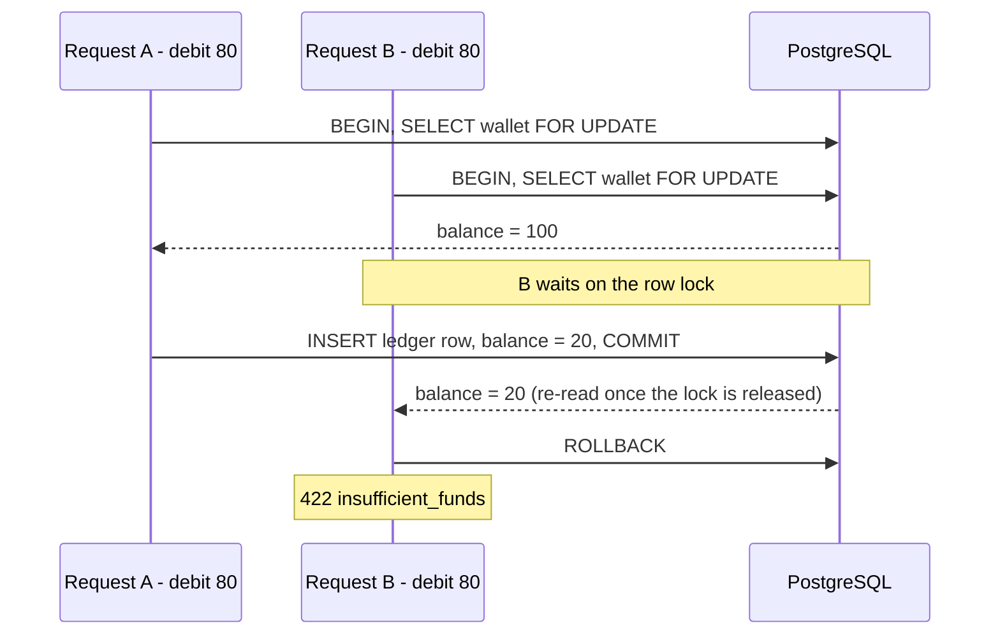

# Concurrent Wallet Operation

[](https://github.com/MortezaPZ/concurrent-wallet-api/actions/workflows/ci.yml)

A small Django REST Framework service that debits a wallet **safely under concurrency** and
**exactly once per `request_id`**. Correctness lives in the database: a `SELECT ... FOR UPDATE`
row lock, a unique idempotency key, check constraints, and an append-only trigger.

Stack: Django 5.2, DRF 3.18, PostgreSQL 14/16, psycopg 3. Python 3.11 - 3.13.

---

## Quick start

```bash
cp .env.example .env
docker compose up -d --wait postgres         # or point .env at your own PostgreSQL
python -m venv .venv && . .venv/bin/activate # Windows: .venv\Scripts\activate
pip install -r requirements-dev.txt
python manage.py migrate                     # also creates the demo wallet with balance 100
python manage.py runserver
```

`migrate` seeds one wallet with id `00000000-0000-0000-0000-000000000001` and balance `100.00`.
Interactive API docs: <http://127.0.0.1:8000/api/docs/>

```bash
W=00000000-0000-0000-0000-000000000001

curl -s localhost:8000/api/wallets/$W/
curl -s -X POST localhost:8000/api/wallets/$W/debit/ \
     -H 'Content-Type: application/json' \
     -d '{"amount": "80.00", "request_id": "order-1"}'
curl -s localhost:8000/api/wallets/$W/transactions/
```

## Tests

```bash
pytest -v                 # whole suite
pytest -v -m concurrency  # only the parallel-session scenarios
```

The suite **only runs on PostgreSQL** - there is no SQLite fallback anywhere in the settings,
because `SELECT ... FOR UPDATE` is a no-op on SQLite and every concurrency guarantee here would
silently become untested. `tests/test_concurrency.py` opens real parallel connections
(`--reuse-db` is never used, tests are marked `transaction=True`) and one scenario drives the
race through actual HTTP requests against a live server.

CI runs lint, `makemigrations --check`, schema validation and the full suite on
Python 3.11/3.12/3.13 against PostgreSQL 16, plus PostgreSQL 14.

## API

| Method | Path | Result |
| --- | --- | --- |
| `GET` | `/api/wallets/` | List wallets |
| `GET` | `/api/wallets/{id}/` | Balance and timestamps |
| `GET` | `/api/wallets/{id}/transactions/` | That wallet's ledger, newest first, paginated |
| `POST` | `/api/wallets/{id}/debit/` | Debit `{"amount", "request_id"}` |
| `GET` | `/api/transactions/` | Whole ledger, `?wallet=<id>` to filter |
| `GET` | `/api/transactions/{id}/` | One ledger entry |
| `GET` | `/api/schema/`, `/api/docs/` | OpenAPI 3 schema and Swagger UI |
| `GET` | `/healthz` | Liveness probe |

### Debit outcomes

| Status | Meaning |
| --- | --- |
| `201 Created` | Debit applied, balance reduced |
| `200 OK` | Same `request_id` and amount replayed - **nothing debited again** (`Idempotent-Replay: true`) |
| `400 Bad Request` | `validation_error` - malformed amount or `request_id` |
| `404 Not Found` | `wallet_not_found` |
| `409 Conflict` | `idempotency_key_conflict` - that `request_id` was used with a different amount |
| `422 Unprocessable` | `insufficient_funds` - balance would go negative |

Every error uses one envelope:

```json
{"error": {"code": "insufficient_funds",
           "message": "Balance is not sufficient for this debit.",
           "details": {"balance": "20.00", "requested": "80.00", "shortfall": "60.00"}}}
```

## Requirement coverage

| # | Requirement | Where it is proven |
| --- | --- | --- |
| 1 | Balance and transaction APIs | `tests/test_api.py` |
| 2 | Debit with `amount` + `request_id` | `tests/test_api.py` |
| 3 | Balance never goes negative | `tests/test_negative_balance.py` |
| 4 | Replaying a `request_id` does not debit twice | `tests/test_idempotency.py` |
| 5 | Same `request_id`, different amount -> error | `tests/test_idempotency.py` |
| 6 | Two simultaneous debits of 80 -> exactly one succeeds | `tests/test_concurrency.py` |
| 7 | Recorded transactions cannot be edited or deleted | `tests/test_immutability.py` |

## Technical decisions

**Pessimistic row lock, not application logic.** `services.debit()` opens one transaction, takes
`SELECT ... FOR UPDATE` on the wallet row, then reads the balance, decides, writes, and appends the
ledger entry. The lock makes read-check-write atomic, so two workers cannot both observe `100` and
both debit `80`. The loser simply waits, then re-reads a balance of `20` and is rejected with
`insufficient_funds`. This is why requirement 6 is deterministic rather than "usually right".



Alternatives considered:

- *`F("balance") - amount` alone* - atomic as a write, but the "is there enough?" decision still
  races. It would need a `filter(balance__gte=amount).update(...)` compare-and-set plus a retry
  loop, and it cannot cover the "insert the ledger row too" half of the operation.
- *Optimistic locking / version column* - needs client retries and turns a guaranteed rejection
  into a probabilistic one.
- *`SERIALIZABLE` isolation* - correct, but pushes serialization failures onto every caller. With
  `READ COMMITTED` + an explicit row lock there is nothing to retry, and the lock window is exactly
  as long as one debit.
- *Redis / advisory locks* - another moving part that can disagree with the durable state. The row
  that holds the money is the right thing to lock.

**Idempotency is a database constraint, not a cache.** `UNIQUE (wallet_id, request_id)` is the real
guarantee; the in-transaction lookup is just how a replay gets a friendly `200` instead of an
`IntegrityError`. The service still catches `IntegrityError` as a second line of defence. Keys are
scoped per wallet, so two wallets may legitimately use the same `order-1`. A replay with a
different amount is a **client bug**, so it is reported as `409` rather than silently ignored, and a
*rejected* debit consumes nothing - the same `request_id` can be retried once funds arrive.

**Money is `Decimal(18, 2)` everywhere** - never float. Input is parsed as a string, quantized once
in the service, and validated to at most 2 decimal places.

**The ledger is append-only, defended three times**: DRF exposes read-only viewsets (write verbs
are not routed at all, so they return `405`), `Transaction.save()/delete()` raise on any modification
of an existing row, and a PostgreSQL `BEFORE UPDATE OR DELETE` trigger rejects anything that reaches
the table by another path - raw SQL, `.update()`, a future admin, or a psql session. Each entry
stores `balance_after`, so the ledger reconstructs history without replaying arithmetic.

**A ledger needs a total order, and timestamps do not give one.** Clock resolution ties are
real - on Windows several entries land in the same ~15 ms tick - and a random UUID is not a
tie-breaker, so `ORDER BY created_at DESC, id DESC` returns tied rows in arbitrary order. Entries
therefore carry a `sequence` taken from a PostgreSQL sequence and are ordered by it. Because inserts
for a wallet happen under that wallet's row lock, insertion order is also commit order.
`test_ledger_order_survives_identical_timestamps` is the regression test.

**Constraints belong in the schema.** `balance >= 0`, `amount > 0` and `balance_after >= 0` are
`CHECK` constraints, so even a bug in future code cannot persist an impossible state. The wallet FK
is `PROTECT`: history is never orphaned.

**Layering.** Views validate and translate; `services.py` owns the transaction boundary and the
domain rules; models own invariants. The concurrency tests call the service directly *and* over
HTTP, which shows the guarantee is in the domain layer, not in a view.

**Not used: `ATOMIC_REQUESTS`.** Wrapping whole requests would hold the row lock for the lifetime of
the request, including serialization. The lock is taken explicitly, as late and as briefly as
possible.

**Out of scope** (per the brief): authentication, payment gateway, admin panel, UI, deployment.
Because of that, `django.contrib.auth`, `sessions` and `admin` are not installed at all - a smaller
attack surface and a faster test run, rather than a default project with dead apps in it.

### What would come next in production

Credit/refund operations and a transfer endpoint reusing the same lock ordering; an outbox table for
downstream events; `statement_timeout` and lock-wait metrics; per-key rate limiting; and partitioning
or archiving the ledger once it grows.

## Layout

```
config/          settings, urls, wsgi/asgi
wallets/
  models.py      Wallet, Transaction (+ constraints, append-only guards)
  services.py    debit(): the transaction boundary and the row lock
  serializers.py request/response contracts and input validation
  views.py       read-only viewsets + the debit action
  exceptions.py  domain errors -> one HTTP error envelope
  seed.py        the demo wallet, shared by migration and CLI
  migrations/    schema, append-only trigger, demo wallet
tests/           one file per requirement group
.github/workflows/ci.yml
```
